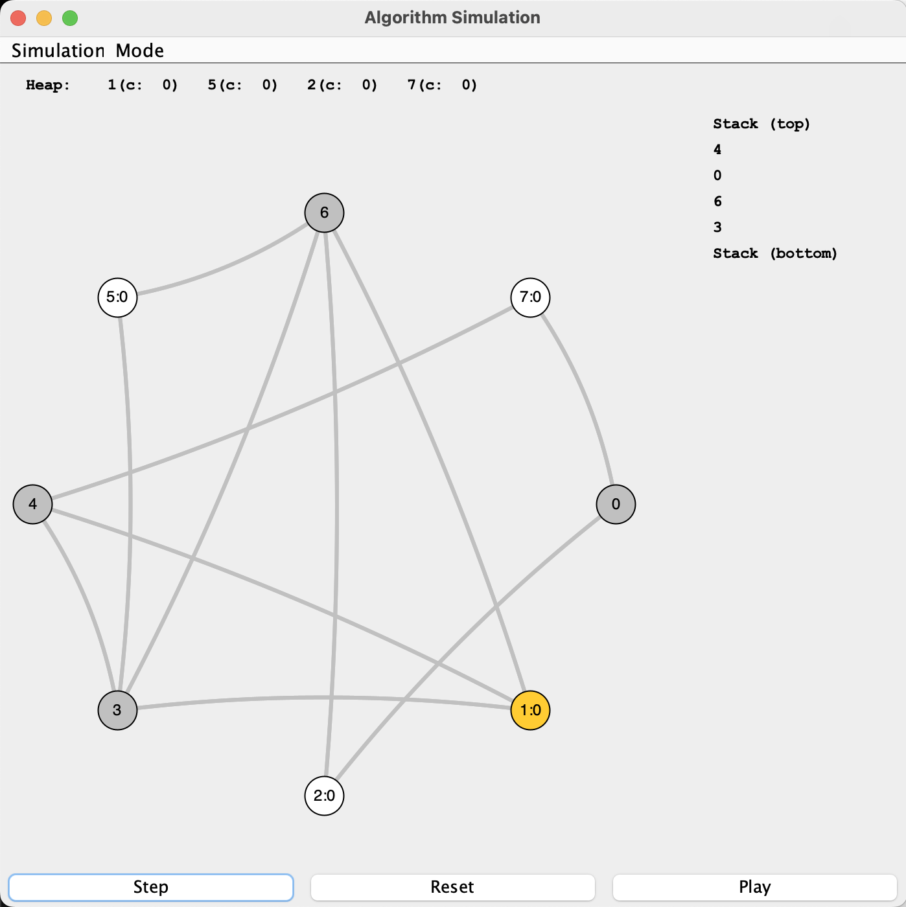
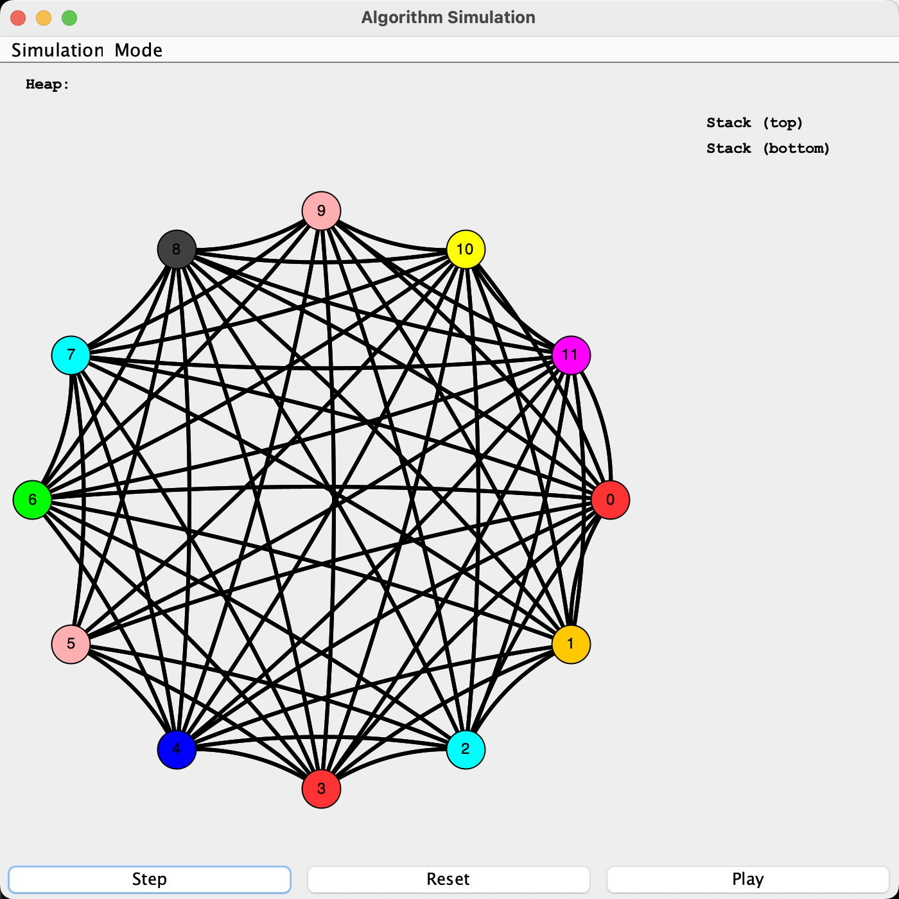

## Examples
[back](README.md)

Example runs of the simulator are given below:
1. [Displaying a graph](#example-1)
2. [Adding nodes and edges to a graph](#example-2)
3. [Removing a nodes and edges from a graph](#example-3)
4. [Running Coloring Algorithm in the simulator](#example-4)
5. [Graph Not Colorable](#example-5)

### Example 1
Displaying a Graph

Once you have the `ThreeTenGraph` class working, you can run the main program to test and debug. The main program is `SimGUI`, which can be compiled and run with the following commands (from your user directory) if you are on Windows:

```
javac -cp .;../310libs.jar *.java
java -cp .;../310libs.jar SimGUI
```

or the following commands if you are on Linux/MacOS:

```
javac -cp .:../310libs.jar *.java
java -cp .:../310libs.jar SimGUI
```

Why is there extra stuff? The `-cp` is short for `-classpath` (meaning "where the class files can be found). The `.;..\..310libs.jar` or `.:../310libs.jar` has the following components: `.` the current directory, `;` or `:` the separator for Windows or Linux/MacOS respectively, `.,.` up one directory, `310libs.jar` the provided jar file which contains the library code for JUNG.

If you run the simulator with the above command, you will get an eight node graph with some random edges. Each time you hit "reset" you get another graph, but the same sequence of graphs is always generated (for your testing). However, the simulator can also be run with some additional optional parameters to get some more interesting results: The number of nodes, the likelihood that two nodes have an edge between them, the random seed for the graph generator. For example:

Image|Command|Explanation
:---: | :---: | :---:
|`java -cp .;../310libs.jar SimGUI`|Generate an eight node graph, with connection probability of 0.5, and seed 0.
|`java -cp .;../310libs.jar SimGUI 10 1`|Generate a ten node graph where all nodes are connected.
|`java -cp .;../310libs.jar SimGUI 12 0.3`|Generate a twelve node graph where nodes have a 30% chance of being connected.
|`java -cp .;../310libs.jar SimGUI 8 0.5 1123`|Generate a different sequence of graphs using seed 1123.

### Example 2
Adding nodes and edges to a graph

You'll want to test out adding multiple nodes and edges from your graphs to make sure you've gotten out all the bugs.

Image|Explanation
:---: | :---:
|Select "Mode", then "Editing".
|Click Anywhere on the graph surface to add a node.
|Drag to another node to add an edge with a random weight.

### Example 3
Removing a nodes and edges from a graph

You'll want to test out removing multiple nodes and edges from your graphs to make sure you've gotten out all the bugs.

Image|Explanation
:---: | :---:
|In any mode, right click a node and select "delete vertex".
|In any mode, right click an edge and select "delete edge".

Image|Explanation
:---: | :---:

### Example 4
Running coloring in the simulator

You can try out our coloring algorithm one step at a time to help debugging your code.

Stage | Image|Explanation
:---:|:---: | :---:
Start| |Setup your graph (you can zoom with mouse scroll; empty heap and empty stack)
Stage 1| |Hit "Step" (nodes should now show costs; all ndoes added to heap; node of highest degree highlighted)
Stage 1||Hit "Step" ( max node pushed into stack with its edges inactive; neighbors show their updated cost; next max node highlighted, repeat ...)
Stage 1||Hit "Step" for more times (all edges inactive; still need to process nodes in heap one by one ...)
Stage 1||Hit "Step" for more times (all nodes in stack while heap empty: end of Stage 1)
Stage 2||Hit "Step" (stack top popped off; decide a color that not used by any neighbor; all incident edges also take the same color to give nodes-to-be-colored a hint, repeat ...)
Stage 2||Hit "Step" for more times (pink already in use, pick the next color (green))
Stage 2||Hit "Step" for more times (all nodes colored using 3 colors; stack empty)
Stage 2||Hit "Step" (end of coloring; switch edge back to normal color (black))


### Example 5
What happens for graphs not colorable?

We have pre-defined 8 colors (check `ThreeTenColor.COLORS` for details) to use and it is possible a graph cannot be colored using only 8 colors.  For those graphs, the simulator should still step through all nodes to push them into the stack. However, we may not be able to find a valid color for all nodes, especially those close to the bottom of stack.

Image|Explanation
:---: | :---:
|Completed run for a graph that is not 8-colorable. Node 0 and 3 are marked with the red warning color (`ThreeTenColor.COLOR_WARNING`).