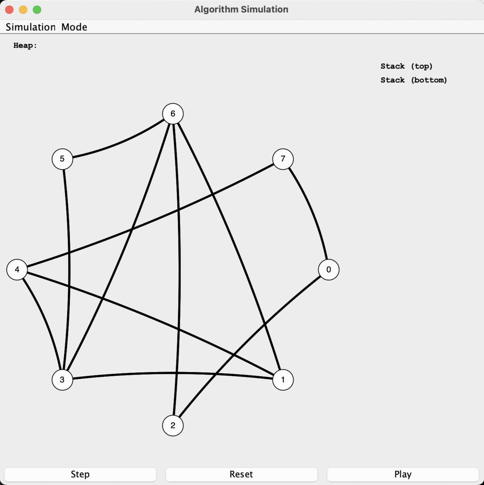

# Graph Algorithm Simulator

CS 310 Programming Assignment 4 Due: **November 17th** (Thursday) 11:59pm, 2022

## Quick Links
1. [Task Overview and Schedule](#tasks-overview)
2. [Examples Page](EXAMPLES.md)
4. [Task Details](TASKS.md)
5. [Rules Page](RULES.md)
6. [Submission Instructions](RULES.md#submission-instructions)
7. [Grading Rubric Page](GRADING.md)

## Assignment Objectives
- Create and use a _graph_ data structure.
- Update a _priority queue (heap)_ data structure for new features.
- Understand and complete a _graph coloring_ simulation based on Chaitin's Algorithm, integrating key components with existing visualization code.
- Apply basic knowledge of Big-O.

## Assignment Overview
Professional code often uses existing libraries to quickly prototype interesting programs. You are going to use 2-3 established libraries to quickly develop the internal representation of an advanced data structure (a graph) and simulate a simple graph algorithm (Chaitin's Coloring Algorithm). This GUI can be easily extended to other types of algorithms you might encounter in the future (such as in CS483), and you may find it useful to simulate later algorithms you learn using this same framework.

The four libraries you are going to use are:
1. The PriorityQueue portion of the Weiss data structures library from your textbook (this is provided to you with your textbook for free on the author’s website, if you’ve never looked).
2. Your previous project code - You will need a hash table for part of this project, and you have written one in Project 3. You're encouraged to reuse your implementation!
3. The Java Collections Framework - This is a collection of existing simple data structures (lists, queues, sets, maps, etc.) which can form the basis for more advanced data structures.
4. A subset of [JUNG](http://jung.sourceforge.net/) (Java Universal Network/Graph Framework) - This library provides a lot of cool visualization tools for graphs: automatic layouts for graphs, an easy interface for creating/editing graphs, and much more.

## Tasks Overview

There are **5** tasks in this assignment. It is suggested that you implement these tasks in the given order:

- Task 1: Examine the JCF Classes (0%)
- Task 2: Read the Provided Code Base (0%)
- Task 3: Implement an Undirected Graph Class to Support the Simulator (60%)
- Task 4: Implement an Efficient Update Mechanism for a Heap Class (20%)
- Task 5: Implement Chaitin's Algorithm in the Simulator (20%)

See the [Examples Page](EXAMPLES.md "") for what the simulator should be able to do when you are done, and then see the [Task Details Page](TASKS.md "") for a walk-through of each specific task.

Need a schedule?
- You've got 2.5 weeks.
- You have other classes with final exams/projects.
- Assume you want to spend the last half week doing the EC and getting additional help.
- Keeping those things in mind, fill in the following:
  - 11/01-11/03: _______________________________ (first week)
    - Suggestions: Task 1 and Task 2
  - 11/04-11/06: _______________________________ (first weekend)
    - Suggestions: JavaDocs for All Classes, Start Task 3
  - 11/07-11/11: _______________________________ (second week)
    - Suggestions: Finish Task 3 and Start Task 4
  - 11/12-11/14: _______________________________ (second weekend)
    - Suggestions: Finish Task 4 and Task 5
  - 11/15-11/17: _______________________________ (third week)
    - Suggestions: Turn in early for extra credit

## Rules and Grading
As with all projects in CS310, we have some rules (see [Rules Page](RULES.md "")) and a grading rubric (see [Rubric Page](GRADING.md "")).
