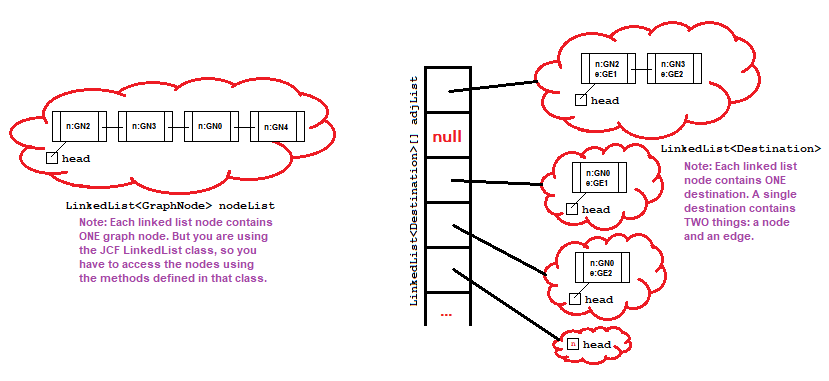
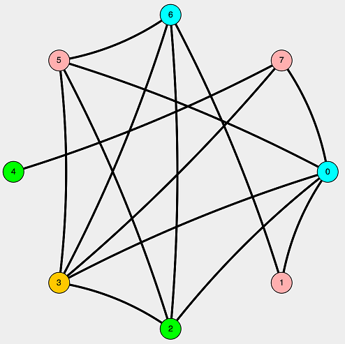

## Tasks
[back](README.md)

There are **5** tasks in this assignment. It is suggested that you implement these tasks in the given order. 

1. [Task 1: Examine the JCF Classes (0%)](#task-1-examine-the-jcf-classes-0)
2. [Task 2: Read the Provided Code Base (0%)](#task-2-read-the-provided-code-base-0)
3. [Task 3: Implement an Undirected Graph Class to Support the Simulator (60%)](#task-3-implement-an-undirected-graph-class-to-support-the-simulator-60)
4. [Task 4: Implement an Efficient Update Mechanism for a Heap Class (20%)](#task-4-implement-an-efficient-update-mechanism-for-a-heap-class-20)
5. [Task 5: Implement Coloring Algorithm in the Simulator (20%)](#task-5-implement-coloring-algorithm-in-the-simulator-20)

Additionally, there are some [Examples for Testing](#examples-for-testing) at the bottom of this page that you should read before running the simulator.

### Task 1: Examine the JCF Classes (0%)

Read and familiarize yourself with the JCF classes. You must use these classes in your project, so becoming familiar with them *before* starting is important. Below is an overview of the classes:

1. [LinkedList](https://docs.oracle.com/javase/8/docs/api/java/util/LinkedList.html) - Java's linked list class
2. [HashMap](https://docs.oracle.com/javase/8/docs/api/java/util/HashMap.html) - Java's map class supported by a hash table
3. [Collection](https://docs.oracle.com/javase/8/docs/api/java/util/Collection.html) - All JCF classes implement this generic interface.

Where should you start? The Java Tutorials of course! (If you didn't know, Oracle's official Java documentation includes a set of tutorials.) The [Trail: Collections](https://docs.oracle.com/javase/tutorial/collections/) tutorial will provide you with more than enough information on how to use these classes.

### Task 2: Read the Provided Code Base (0%)

Read and familiarize yourself with the code. This will save you a lot of time later. An overview of the provided code in is given below, but you need to read the code base yourself.

```java
//This class is the parent class of all graph components.
//It is provided and should not be altered.
class GraphComp {...}

//This class represents a node in a graph.
//It is provided and should not be altered.
class GraphNode extends GraphComp {...}

//This class represents an edge in a graph.
//It is provided and should not be altered.
class GraphEdge extends GraphComp {...}

//This class represents an undirected graph.
//You will write 99% of this class, but a template is provided.
class ThreeTenGraph implements Graph<GraphNode,GraphEdge>, UndirectedGraph<GraphNode,GraphEdge> {...}

//This is the Priority Queue code from your textbook. It is technically complete,
//but for the Color Algorithm it will need some improvements (done by you).
class WeissPriorityQueue {...}

//These are part of the textbook library and support the Weiss
//PriorityQueue. They are complete.
class WeissCollection {...}
class WeissAbstractCollection {...}

//This interface defines an algorithm that can be simulated with the GUI
interface ThreeTenAlg {...}

//You will be writing this algorithm (Coloring based on Chaitin's Algorithm)
class ThreeTenColor implements ThreeTenAlg {...}

//This is the simulator and handles all the graphical stuff, it is provided.
class SimGUI {...}

```

You are required to complete the JavaDocs and adhere to the style checker as you have been for all previous projects. The checkstyle.jar and associated .xml files are the same as on previous projects. You need to correct/edit the provided style and/or JavaDocs for some classes because the Weiss and JUNG library comments don't quite adhere to the style requirements for this class. Updating/correcting another coder’s style is a normal process when integrating code from other libraries – so this is boring but necessary practice for the “real world”.

It is HIGHLY RECOMMENDED that you write your JavaDocs for this project during this stage. That way you will have a full understanding of the code base as you work. Don’t overdo it! Remember you can use the inheritdoc comments for inheriting documentation from interfaces and parent classes!

### Task 3: Implement an Undirected Graph Class to Support the Simulator (60%)

In order for the simulator to work, you need an internal representation of a graph. The JUNG library provides an interfaces for this: `Graph<V,E>`. You need to implement the undirected graph `ThreeTenGraph` (in `ThreeTenGraph.java`) which implements the `Graph<GraphNode,GraphEdge>` interface.

The method of storage we are going to use is a little different than the ones we've shown in class. It is at its core an adjacency list, but with the following changes:

1. To store information about the nodes themselves, we need to keep some GraphNode objects (one per vertex in the graph). To do this you will use an additional `LinkedList` of `GraphNodes` (type `LinkedList<GraphNode>`).
2. To store the edges of the graph, we will be using an adjacency list, but this will be an array of JCF `LinkedList` objects (LinkedList[]), rather than an array of `Node` pointers as shown in class. `LinkedList` is just Java's wrapper class for linked lists, so it is *conceptually* the same, and similar to the array of linked lists you worked with in Project 3.
2. Every GraphNode has an ID property and we promise that we will never create or consider a graph with IDs below 0 or above 199 (but ID 199 _is_ possible). So this should give you an idea of the size of the adjacency list.
3. The adjacency matrix needs to represent three things about an edge: the two nodes it connects and the edge properties. These have been discussed in class, but here is how they will be represented in this project:
   - The source node -- same as in class, the array index indicates the id of the source node.
   - The destination node and edge properties -- at each index of the array is a `LinkedList<Destination>`, a `Destination` has two parts, a `GraphNode` (the destination node) and a GraphEdge (containing all edge properties).

An concept image of the graph storage with four vertices (ID 0, 2, 3, and 4) and two edges (ID 1 and 2) is shown below. Vertex 0 is connected to vertex 2 and 3 with edges 1 and 2 respectively. Vertex with ID 1 is not in the graph and therefore not in `nodeList` and its entry in `adjList` is null. Since this is an undirected graph, vertex 2 and 3 link back to vertex 0 (using the *same* edge objects). Vertex 4 is in the graph but has no edges, so it appears in `nodeList` but the entry in `adjList` is *empty* (not null!).



Remember that all graph components have IDs, and so edges have IDs too (and those IDs do not relate in any way to what vertices they connect, the placement in the adjacency just gives you that information).

Once you understand how the storage should work, you will need to implement several support methods for the graph visualization. Below is a quick overview of the methods you need to support. Note that in the template, actual JavaDoc comments are provided. That said, the JavaDocs are those from the `Graph<>` interface and the `HyperGraph<>` interface in JUNG. They have been copied from that library for your reference, but are otherwise unaltered. Part of this assignment is to practice reading "real" documentation and understanding what to implement based on the library's requirements.

```java
//********************************
// Graph Editing (~20%)
//********************************

boolean addEdge(GraphEdge e, GraphNode v1, GraphNode v2 {...}
boolean addVertex(GraphNode vertex) {...}

boolean removeEdge(GraphEdge edge) {...}
boolean removeVertex(GraphNode vertex) {...}


//********************************
// Graph Information (~40%)
//********************************

//For a given graph...

Collection<GraphEdge> getEdges() {...}
Collection<GraphNode> getVertices()  {...}

int getEdgeCount() {...}
int getVertexCount() {...}


//For a given vertex in a graph...

boolean containsVertex(GraphNode vertex) {...}
Collection<GraphEdge> getIncidentEdges(GraphNode vertex) {...}

Collection<GraphNode> getNeighbors(GraphNode vertex) {...}
int getNeighborCount(GraphNode vertex) {...}


//Given two vertices in a graph...

E findEdge(GraphNode v1, GraphNode v2) {...}


//Given an edge in a graph...

Pair<GraphNode> getEndpoints(GraphEdge edge) {...}


//Given a vertex and an edge in a graph...

boolean isIncident(GraphNode vertex, GraphEdge edge) {...}
 
```

When you are done with this step, you can generate and play with some graphs in the simulator (see the [Examples Page](EXAMPLES.md "")).

_Hints and Notes_
- Read ALL the methods before you decide how to implement any methods, you may need/want to reuse code from some methods in implementing others.
- Note that we cannot test editing a graph or getting information about a graph independently of each other. So you cannot get points for completing only the graph editing or only the graph information parts of this interface, you need everything...

### Task 4: Implement an Efficient Update Mechanism for a Heap Class (20%)

The graph simulator is going to run a cool "coloring" algorithm, but this requires a priority queue with the ability to *update* the priority of individual items. If you look at your textbook, it gives information in Chapter 21 (section 4) about the "decrease key" operation. We want a similar update() operation which increases (or decreases) the priority of the item. The item (or an equal item) will be provided and it should update the priority queue appropriately.

The only way to do this efficiently is to use a map to map heap items to indexes so that you know where to start the update (in average case O(1) time). Without this, update() would be O(n) and not O(lg n). Therefore before you implement updating, you need to integrate a map into the Weiss code. Whenever an item is placed, moved, or removed from the heap, the map should updated to reflect the item's new index (or remove it from the map in the case of removal from the heap). You are welcome to use the JCF HashMap class for this, or you may use your HashMap implementation from Project 3 (your choice).

### Task 5: Implement Coloring Algorithm in the Simulator (20%)

Now for the fun part! You will implement a graph coloring simulation based on Chaitin's algorithm.  

#### 5.1 Graph Coloring

Graph coloring refers to the process of assigning a "label" or "color" to elements of a graph subject to certain constrains.  We will simulate a vertex coloring in this project.  The goal is pick a color for every node in the graph such that no two _adjacent_ nodes are assigned the same color. For example, below is one coloring of a graph with 8 nodes using 4 colors.



#### 5.2 Coloring Algorithm

Graph coloring problem has motivated many practical applications and theoretical challenges.  For this project, we will follow a coloring algorithm based on _Chaitin's Algorithm_, which is a classic algorithm for register allocation in compilers.  The algorithm we will use consists of two major stages as below:

- **Stage 1**: Simplify the graph.  Start with the original graph and an empty stack.
    - Pick the vertex with the highest degree; use the unique node ID to break the tie.
    - Push the vertex into the stack.  Drop the vertex and all incident edges from the graph.  Note that this simplification will lower the degree of the neighbors of the node to remove.
    - Repeat the process until all nodes are in stack.
    
- **Stage 2**: Assign the color.  Start with an empty graph and the stack with all original nodes.
    - Pop a node from stack to restore the graph. 
    - Assign a color that has not been used by any of its neighbors. Note that there might be some neighbors that are still in stack -- they are considered as not colored yet.
    - Repeat the process until all nodes are restored.
    - Note: if we only allow a limited number of colors, then some nodes may fail to find a color to use.


#### 5.3 Overview of Simulation

The simulator would show the coloring algorithm step by step. `ThreeTenColor` (in `ThreeTenColor.java`) will provide the steps for the algorithm, and the main framework is mostly written, but there are some key pieces missing! You're going to implement five required methods to get it working.

An overview of some key parts of `ThreeTenColor` class is given below to get you started.  Make sure to check the actual file (`ThreeTenColor.java`) for detailed description and requirements of each method.

```java
//this is the actual "step" method, which calls other methods you will be finishing up...
boolean step() {
	if(!started) {
		start();
		return true;
	}
	
	cleanUpLastStep();
	if(!setupNextStep()) {
		finish();
		return false;
	}
	doNextStep();
	
	return true;
}

//this does most of the setup for our coloring algorithm
void start() {...}

//performs any "clean up"; not used by this project
void cleanUpLastStep() {...}

//check whether the algorithm is done; switch from stage 1 to stage 2 as needed
boolean setupNextStep() {...}

//main method for the coloring algorithm
//you will need to complete five methods to make this work
void doNextStep() {...}

//cleans up after the algorithm finishes
void finish() {...}

//-------------------------------------------------------
//You need to complete the methods below 
//-------------------------------------------------------

//Stage 1 & start() operation: find out which node has the highest degree and highlight it
public void highlightNextMax(){ ... }

//Stage 1 operation: push node with highest degree to stack and remove it with its edges
public GraphNode findMax(){ ...	}

//Stage 1 operation: lower the degree of the neighbors of the removed node
public void updateNeighborCost(GraphNode maxNode){ ...	}	
	
//Stage 2 operation: decide a color for a node such that no neighbor of the node is assigned the same color
public Color chooseColor(GraphNode node){ ... }
	
//Stage 2 operation: update the color of node and its qualified incident edges
public void updateColor(GraphNode node, Color newColor){ ... }


```

When you are done with this step, you can play the algorithm in the simulator (see the [Examples Page](EXAMPLES.md "")).

_Hints and Notes_
- You are not responsible for making the algorithm work if the user edits the graph while coloring is running. Just assume all editing will take place before hitting "step" or "play" and that, if they want to do the algorithm again, they will hit "reset" and generate a new graph.

### Examples for Testing

`WeissPriorityQueue` and `ThreeTenGraph` have main methods for testing. You should thoroughly test these classes before trying to run the simulator. If you see errors/weird things in the simulator it means something is wrong in YOUR code. All the simulator does is call your methods! For example:

Issue:
- You delete a node, but there are still edges appearing “in the air” on the simulator which should have been removed.

Possible Causes:
- Your removeVertex() method might not be working properly.
- Your getEdges() or getEdgeCount() methods might not be working properly.

Definitely NOT the Cause:
- The simulator is broken.

How do you diagnose the problems?
- Debugger, breakpoints, print statements...
